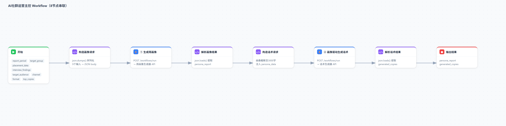
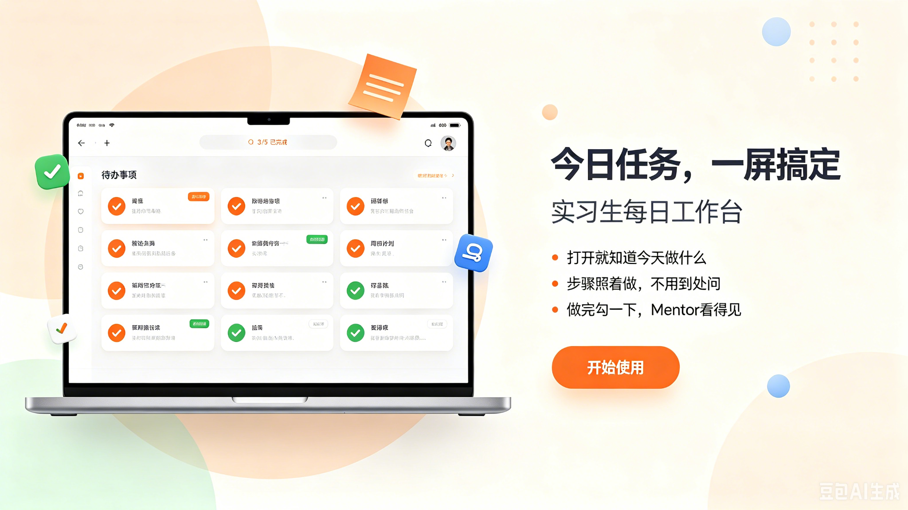

# 火花工坊 HUB — AI 创作者社区运营平台

在 AI 创作者社区冷启动中，用 Dify 落地 4 个应用 + 1 个知识库，把运营者每周 2 小时的手动复盘压缩到 3 分钟；同时完成用户调研、平台重设计、成长体系和 RAG 问答机器人。

## 目录

- [业务背景](#业务背景)
- [用户调研](#用户调研)
- [人机方案](#人机方案)
- [AI 运营平台](#ai-运营平台)
- [RAG 课件问答机器人](#rag-课件问答机器人)
- [实习生工作台](#实习生工作台)
- [平台重设计与成长体系](#平台重设计与成长体系)
- [评测体系](#评测体系)
- [关键产品决策](#关键产品决策)
- [项目反思](#项目反思)

## 业务背景

AI 创作者社区冷启动阶段，运营者每周被困在三件事里：

1. **周复盘耗时**：7 张飞书表手动汇总数据、翻访谈记录写画像，每次 2 小时以上
2. **话术凭感觉**：邀约话术无法复用经验，效果好坏全靠个人手感
3. **课件搜不到**：40 天课程的 528 张课件是图片格式，重复答疑占社群问题 60%

平台本身也有定位问题——Skill 商店被埋没在二级页面，80% 用户不知道它的存在；Top 创作者两周后不再上传。

## 用户调研

通过 24 份问卷 + 访谈，推翻了四个初始假设：

| 我们假设 | 调研发现 | 转向 |
|----------|----------|------|
| 用户需要系统课程 | 67% 反馈「太笼统」，点击率 <5% | 场景化即用方案 |
| Skill 商店是附加功能 | 80% 不知道有 Skill 库 | 提至首页核心位 |
| 发课就是运营 | 重复问题占答疑 60% | OCR + RAG 问答机器人 |
| 创作者靠热情留存 | Top 创作者 2 周后不再上传 | 身份认证 + 成长体系 |

关键数据：直接问需求的邀约回复率 66%，泛泛「学习搭子」互动率仅 3%。

## 人机方案

| 环节 | AI/系统负责 | 人负责 |
|------|------------|--------|
| 周复盘 | 自动汇总数据 + 访谈，生成 9 段式群体画像 | 确认画像、制定运营策略 |
| 话术生成 | 画像驱动生成 3 条不同风格话术，自动写回飞书 | 审核后发送 |
| 课件问答 | RAG 检索 528 张课件，带出处回答 | 超纲问题转人工 |
| 任务执行 | 飞书工作台自动分配任务、汇总状态 | 完成任务、一键勾选 |

关键设计：话术生成器死锁 JSON 输出，因为要自动写回飞书不同字段；超纲问题拒答而非编造。

## AI 运营平台

把运营者每周「汇总数据 → 翻访谈 → 写画像 → 写话术 → 录入文案库」的 2 小时手动流程，重构为 Dify 上一键运行的自动化闭环。

| 应用 | 类型 | 做什么 | 关键设计 |
|------|------|--------|----------|
| 问答助手 | Chatflow | RAG 检索 16 篇文档，带出处回答社群问题 | TopK=3，相似度 0.5，超纲拒答 |
| 周画像生成器 | Workflow | 投放数据 + 访谈 → 9 段式群体画像报告 | 每个痛点附访谈原话作证据 |
| 话术生成器 | Workflow | 画像驱动生成 3 条不同风格话术 | JSON 输出，Code 解析后自动写回飞书 |
| 主控 Workflow | Workflow | 8 节点 HTTP 串联画像 → 话术全链路 | Code 节点 json.dumps 解决转义 |

**效果**：周复盘从 2 小时压缩到 3 分钟；话术自动写回飞书文案库；20 题黄金集评测通过率 90%。

**踩坑记录**：HTTP 节点 body 模板替换会破坏含换行符的 JSON（返回 400），用 Code 节点 Python `json.dumps()` 预序列化解决。

## RAG 课件问答机器人

将 40 天课程的 528 张课件 OCR 化，搭建微信公众号 RAG 问答机器人：

- 学员在公众号提问，RAG 检索课件内容后带出处回答
- 15 题评测（引用准确 / 边界拒答 / 口语化召回）全部通过
- 检索匹配率从最初的 5/15 提升到 15/15——不是换了更大的模型，而是写脚本定位到「长句 AND 匹配过严」这个具体原因，调整分块策略后解决

## 实习生工作台

担任 Mentor 管理实习生时发现「落表」每天花 30 分钟，用飞书 Base App 搭建工作台把流程砍到最短：

| | 改版前 | 改版后 |
|---|--------|--------|
| 操作步骤 | 看文档 → 找任务 → 做 → 登记 → 汇报 | 打开 → 做 → 勾 |
| 日均耗时 | 30 分钟填表 | 5 分钟 |
| 触达完成率 | 70% | 95% |

6 大模块可视化任务面板（触达 / 社群 / 供给线 / 情报 / 数据看板 / 我的），任务自动分配、状态一键更新、数据自动汇总。

## 平台重设计与成长体系

基于调研结果，对平台进行重设计：

| 页面 | 改版前 | 改版后 |
|------|--------|--------|
| 首页 | 信息流图文笔记 | Skill 库推荐 + 场景入口 |
| 工具箱 | 二级页面附加功能 | 一级导航，分类展示 |
| 个人主页 | 只有作品列表 | 身份等级 + 成长值 + 成就徽章 |

**成长体系**：三类身份（学习者 / 创作者 / 导师）× 五级等级（Lv1 探索者 → Lv5 导师），成长值奖励「有用」（下载 +5、Fork +10）而非「认同」（点赞权重低），含防刷分机制。

## 评测体系

上线前定义黄金集，每次改 Prompt 后回归验证：

| 评测集 | 类别 | 题数 | 通过率 |
|--------|------|------|--------|
| 问答助手 | 学习路径 / 工具推荐 / 社群活动 / 话术查询 | 20 | 90%（18/20） |
| 课件机器人 | 引用准确 / 边界拒答 / 口语化召回 | 15 | 100%（15/15） |

失败 Case 直接转化为行动：工具推荐类缺国产工具知识 → 补充文档；话术编号格式不统一 → 统一格式。

## 关键产品决策

不是选「最先进的技术」，而是选「最适合这个场景的方案」：

| 决策点 | 选择 | 为什么不选另一个 |
|--------|------|------------------|
| 知识方案 | RAG | Fine-tuning 每周重新训练成本高，且无法引用来源 |
| 应用架构 | Chatflow + Workflow 拆分 | 一个应用会让交互逻辑混乱，且 Workflow 可被 HTTP 串联 |
| 输出格式 | JSON 死锁 | 自由文本无法可靠解析写回飞书字段 |

## 项目反思

这段经历走完了「发现问题 → 定义方案 → 落地工具 → 验证效果」的完整闭环。24 份问卷推翻了「发课程 = 提供价值」的假设；检索匹配率从 5/15 到 15/15 不是换了更大的模型，而是写脚本定位到「长句 AND 匹配过严」这个具体原因。

AI 产品经理的价值不在于调 API，而在于定义「什么是好」——有出处、不编造、周复盘从 2 小时变 3 分钟——然后用数据验证它。

## License

MIT
